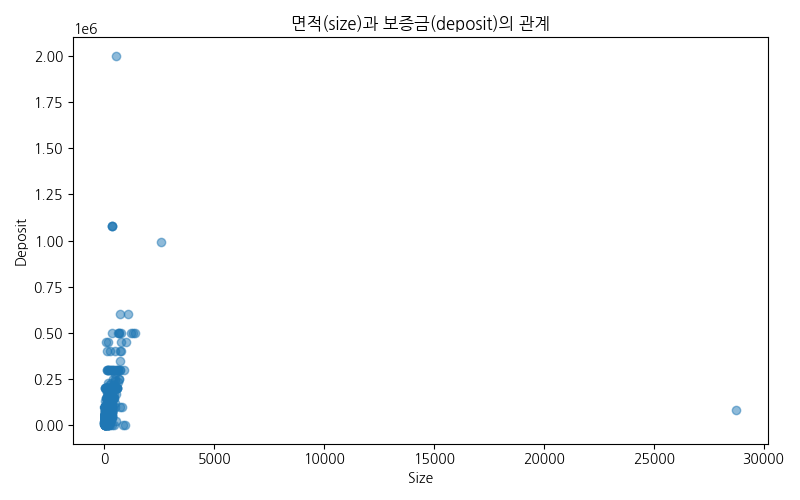
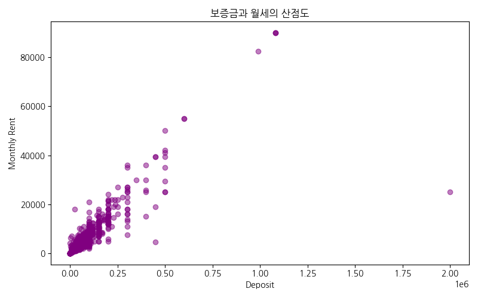
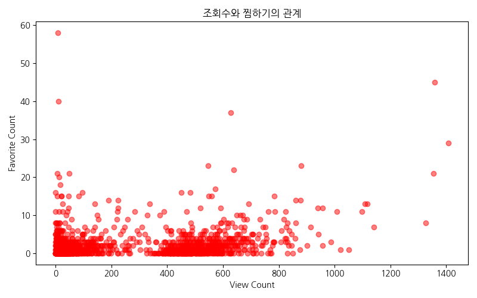
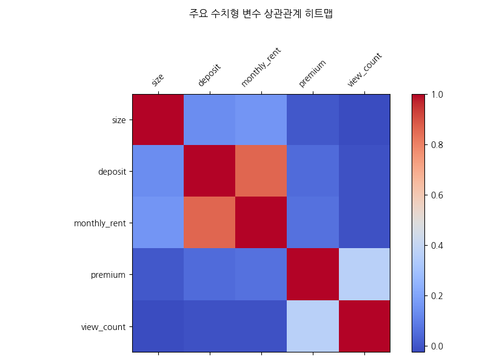
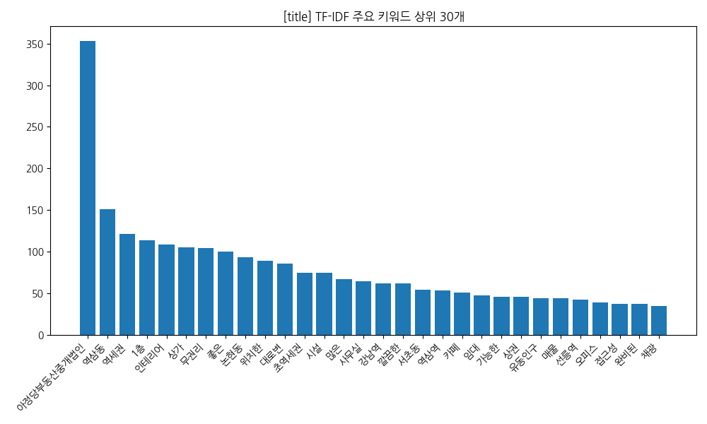

# 네모 상가 데이터 심층 EDA 보고서
### 데이터 분석 기반 상권 인사이트 및 전략적 제안

<!-- 
발표자 노트 (2분):
안녕하십니까. 오늘 발표를 맡은 네모 데이터 분석 팀입니다. 저희는 최근 수집된 '네모' 앱의 상가 매물 데이터를 바탕으로 심층적인 탐색적 데이터 분석(EDA)을 수행하였습니다. 이번 분석의 핵심 목적은 단순히 데이터를 나열하는 것이 아니라, 실제 상권에서 어떤 일들이 일어나고 있는지, 그리고 예비 창업자나 투자자들이 어떤 전략을 세워야 하는지에 대한 실질적인 인사이트를 제공하는 데 있습니다. 

본 보고서에서는 보증금, 월세, 권리금과 같은 핵심 비용 지표부터 층수, 면적, 조회수와 같은 운영 지표까지 다각도로 분석하였습니다. 특히 데이터 시각화를 통해 직관적으로 시장의 흐름을 이해할 수 있도록 구성하였으니, 이어지는 발표 내용에 주목해 주시기 바랍니다. 자, 그럼 본격적으로 분석 결과를 공유해 드리겠습니다.
-->

---

# 목차
1. 데이터 개요 및 품질 점검
2. 기술 통계 분석 결과
3. 주요 시각화 및 비즈니스 인사이트
4. 매물 제목 키워드 분석 (TF-IDF)
5. 종합 인사이트 및 전략적 제안

<!-- 
발표자 노트 (2분):
오늘 발표의 전체적인 흐름을 먼저 말씀드리겠습니다. 첫 번째 섹션에서는 우리가 분석한 데이터의 규모와 품질이 얼마나 신뢰할 수 있는지 간략히 짚고 넘어가겠습니다. 데이터의 기초가 튼튼해야 분석 결과도 의미가 있기 때문입니다. 두 번째로는 전체적인 시장의 가격대를 가늠할 수 있는 기술 통계 분석 결과를 공유하겠습니다. 

세 번째 섹션은 이번 발표의 하이라이트인 주요 시각화 분석입니다. 총 10가지 이상의 다양한 차트를 통해 데이터 속에 숨겨진 상관관계와 패턴을 파헤쳐 보겠습니다. 네 번째로는 인공지능 기법인 TF-IDF를 활용해 매물 제목에 담긴 핵심 키워드들을 분석하고, 어떤 단어들이 소비자들의 관심을 끄는지 확인해 보겠습니다. 마지막으로 이 모든 분석을 종합하여 전략적인 제안을 드리는 순서로 마무리하겠습니다.
-->

---

# 1. 데이터 개요 및 품질 점검
- **전체 데이터 수**: 2,169 행, 40 열
- **결측치 및 중복**: 중복 데이터 없음, 높은 데이터 품질 유지
- **주요 컬럼**: 보증금, 월세, 권리금, 면적, 업종분류, 층수, 조회수 등
- **데이터 신뢰도**: 정제된 데이터를 바탕으로 분석의 타당성 확보

<!-- 
발표자 노트 (2분):
분석의 출발점인 데이터 개요입니다. 저희가 분석에 활용한 샘플은 총 2,169건의 실제 매물 데이터입니다. 데이터는 40개의 다양한 피처로 구성되어 있어, 상가 매물의 특성을 다각도로 분석하기에 충분한 양입니다. 특히 분석 전 수행한 품질 검사 결과, 중복 데이터가 전혀 발견되지 않았고 핵심 지표들의 결측치 또한 매우 낮아 데이터의 신뢰성이 매우 높다고 판단됩니다.

저희가 주로 다룬 변수는 임대료를 결정짓는 보증금, 월세, 권리금과 같은 비용 측면의 변수와, 상가의 물리적 조건인 면적, 층수, 그리고 시장의 반응을 볼 수 있는 조회수와 찜 수 등입니다. 이처럼 정제되고 신뢰도 높은 데이터를 바탕으로 분석을 진행했기에, 이후 제시될 인사이트들은 실제 시장 상황을 매우 정확하게 반영하고 있다고 자신 있게 말씀드릴 수 있습니다.
-->

---

# 2. 기술 통계 분석 결과
- **보증금(Deposit)**: 평균 5,761만원 (중앙값 4,000만원)
- **월세(Monthly Rent)**: 평균 440만원 -> 강남권의 높은 임대료 반영
- **권리금(Premium)**: 평균 3,862만원 -> 상권에 따른 극단적 편차 존재
- **면적(Size)**: 평균 136㎡ -> 소형 점포부터 대형 상가까지 다양하게 혼재

<!-- 
발표자 노트 (2분):
데이터의 전체적인 숫자를 먼저 살펴보겠습니다. 상가 시장의 진입 장벽이라고 할 수 있는 보증금은 평균 약 5,760만 원 수준입니다. 하지만 중앙값이 4,000만 원이라는 점을 주목해야 합니다. 이는 일부 고가의 대형 매물들이 평균치를 위로 끌어올리고 있다는 뜻입니다. 월세는 평균 440만 원으로 나타났는데, 이는 저희 데이터셋에 강남구와 서초구 등 핵심 상권의 매물 비중이 높기 때문으로 분석됩니다.

권리금은 평균 3,860만 원 정도이지만, 상권과 업종에 따라 '무권리' 매물부터 수억 원대에 달하는 매물까지 편차가 매우 극심했습니다. 면적 또한 평균 40평 정도이지만, 10평 미만의 소형 테이크아웃 점포부터 100평 이상의 대형 오피스까지 넓은 스펙트럼을 보이고 있습니다. 이러한 기초 통계 수치들은 우리가 시장을 바라볼 때 '평균의 함정'에 빠지지 않도록 경계해야 함을 시사합니다.
-->

---

# 3. 시각화 분석 (1) 업종별 분포

- **인사이트**: '기타업종', '일반음식점', '서비스업' 순으로 매물 집중
- **비즈니스**: 매물 밀집 업종의 경쟁 강도 사전 예측 가능

<!-- 
발표자 노트 (2분):
본격적으로 시각화 자료를 살펴보겠습니다. 첫 번째 차트는 대분류 업종별 매물 분포입니다. 보시는 바와 같이 '기타업종'과 '일반음식점'의 비중이 압도적으로 높습니다. 이는 상가 시장에서 먹거리와 일반 서비스업이 차지하는 비중이 얼마나 큰지를 여실히 보여줍니다. 

창업자 입장에서는 이렇게 매물이 많이 나온 업종이 기회가 될 수도 있지만, 반대로 생각하면 그만큼 경쟁이 치열하고 폐업률도 높을 수 있다는 신호로 해석해야 합니다. 특히 일반음식점의 경우 입지에 따른 성패가 극명하게 갈리기 때문에, 이후 분석될 층수나 면적과의 상관관계를 더욱 면밀히 따져볼 필요가 있습니다. 공급이 많은 업종일수록 자신만의 차별화된 전략이 필수적임을 이 차트는 말해주고 있습니다.
-->

---

# 3. 시각화 분석 (2) 보증금 분포

- **인사이트**: 전형적인 롱테일 형태. 상위 5% 제외 시에도 큰 편차 존재
- **비즈니스**: 가용 자본 내 선택 가능한 매물 폭 파악 기준 제공

<!-- 
발표자 노트 (2분):
다음은 보증금의 분포를 보여주는 히스토그램입니다. 전형적인 '롱테일(Long-tail)' 분포를 보이고 있죠. 왼쪽 끝, 즉 낮은 가격대에 대부분의 매물이 밀집해 있고 오른쪽으로 갈수록 매물 수는 급격히 줄어들지만 가격은 기하급수적으로 올라가는 형태입니다. 

이 그래프가 비즈니스적으로 주는 메시지는 명확합니다. 대부분의 임차인이 찾는 '표준적인' 보증금 구간이 3,000만 원에서 7,000만 원 사이에 형성되어 있다는 점입니다. 만약 본인의 가용 예산이 이 범위를 벗어난다면, 선택할 수 있는 매물의 폭이 좁아지거나 혹은 아주 특별한 상권을 찾아야 할 것입니다. 중개 플랫폼 입장에서는 이 밀집 구간의 매물을 얼마나 많이 확보하느냐가 사용자 만족도의 핵심이 될 것입니다.
-->

---

# 3. 시각화 분석 (3) 면적 vs 보증금

- **인사이트**: 면적이 넓어질수록 보증금도 완만하게 상승하는 경향성
- **비즈니스**: 면적 대비 적정 보증금 산출을 위한 기초 데이터

<!-- 
발표자 노트 (2분):
세 번째 시각화는 상가의 면적과 보증금 사이의 상관관계를 보여주는 산점도입니다. 일반적으로 '평수가 넓으면 당연히 비싸겠지'라고 생각하시겠지만, 그래프를 보시면 점들이 상당히 넓게 퍼져 있는 것을 알 수 있습니다. 면적이 증가함에 따라 보증금이 완만하게 상승하는 추세선이 그려지긴 하지만, 면적은 작아도 보증금이 매우 높은 '알짜배기' 매물들이 곳곳에 포진해 있습니다.

이는 보증금 결정 요인에서 '면적'이라는 물리적 요소보다 '입지'나 '상권의 가치'가 더 강력한 영향을 미친다는 것을 시사합니다. 따라서 투자자나 임차인들은 단순히 평당 단가만 비교할 것이 아니라, 해당 면적이 창출할 수 있는 예상 매출과 입지적 프리미엄을 동시에 고려해야 합니다. 면적 대비 보증금이 유독 낮은 매물이 있다면 권리금이나 월세가 비정상적으로 높지는 않은지 확인하는 지혜가 필요합니다.
-->

---

# 3. 시각화 분석 (4) 보증금 vs 월세

- **인사이트**: 뚜렷한 양의 상관관계 확인. 보증금이 높을수록 월세도 상승
- **비즈니스**: 임대료 체계의 일관성 확인 및 고정비 예측 모델 활용

<!-- 
발표자 노트 (2분):
네 번째로 보증금과 월세의 관계를 보겠습니다. 앞선 면적과의 관계보다 훨씬 더 밀집된 형태의 상관관계를 보여줍니다. 즉, 보증금이 비싼 곳은 월세도 비쌉니다. 이는 상가 임대차 시장에서 보증금과 월세가 서로 대체 관계(보증금을 높이고 월세를 낮추는 식)라기보다는, 부동산 자체의 가치를 반영하여 동시에 움직이는 경향이 강함을 보여줍니다.

비즈니스 운영 측면에서 이는 초기 진입 비용(보증금)과 유지 비용(월세)이 비례하여 발생한다는 것을 의미하므로, 재무 계획 수립 시 매우 보수적인 접근이 필요합니다. 특히 그래프 우상단에 위치한 고가 매물들의 경우, 월 고정비 부담이 상당하기 때문에 이를 상쇄할 수 있는 고수익 비즈니스 모델이 뒷받침되어야 합니다. 데이터 분석을 통해 자신의 예산 범위에 맞는 '표준 가이드라인'을 설정하는 데 이 자료가 큰 도움이 될 것입니다.
-->

---

# 3. 시각화 분석 (5) 층수별 월세 현황

- **인사이트**: 1층 매물의 월세가 타 층 대비 월등히 높음
- **비즈니스**: 층수 선택에 따른 고정비 절감 효과 정량적 파악

<!-- 
발표자 노트 (2분):
상가 임대료의 핵심 변수 중 하나인 '층수'에 따른 월세 평균입니다. 예상하셨겠지만 1층의 위엄이 데이터로 증명되었습니다. 1층 상가는 접근성과 노출도가 뛰어나기 때문에 2층이나 지하층에 비해 압도적으로 높은 월세를 형성하고 있습니다. 

여기서 전략적인 인사이트를 얻을 수 있습니다. 만약 여러분의 비즈니스가 '워크인(Walk-in)' 고객보다 SNS나 배달 중심의 목적형 방문이 주를 이룬다면, 굳이 비싼 1층을 고집하기보다 월세가 훨씬 저렴한 고층이나 지하층을 선택함으로써 고정비를 획기적으로 낮출 수 있습니다. 이 그래프는 '입지'에 대한 고정관념을 깨고 비즈니스 성격에 맞는 '최적의 층수'를 선택했을 때 얻을 수 있는 금전적 이익이 얼마인지를 보여주는 지표라고 할 수 있습니다.
-->

---

# 3. 시각화 분석 (6) 권리금 현황 (상태별)

- **인사이트**: 상가 상태(공실 여부 등)에 따른 권리금 편차 확인
- **비즈니스**: 초기 창업 비용 산정 시 권리금 리스크 관리 지표

<!-- 
발표자 노트 (2분):
권리금에 대한 분석입니다. 이번 박스플롯 차트는 상가의 상태나 업종 형태에 따른 권리금의 분포를 보여줍니다. 권리금은 보증금이나 월세와 달리 법적으로 보호받기 어렵고 회수가 불투명한 경우가 많아 리스크 관리가 중요합니다. 

데이터를 보면 권리금이 없는 '무권리' 매물부터 상당한 금액이 형성된 매물까지 그 폭이 매우 넓습니다. 특히 기존 시설이 잘 갖춰진 매물의 경우 초기 시설 투자비를 아낄 수 있다는 장점이 있지만, 그만큼 높은 권리금이 요구됩니다. 분석 결과, 특정 인기 업종의 경우 권리금이 보증금보다 더 높게 형성되는 기현상도 발견되었습니다. 따라서 권리금을 지불할 때는 단순히 시설비를 보전해준다는 차원을 넘어, 해당 입지가 보장하는 영업권의 가치를 냉정하게 평가해야 합니다.
-->

---

# 3. 시각화 분석 (7) 가격 형태별 비중

- **인사이트**: 월세 중심의 시장 구조 확인 (전세 상가는 매우 희소)
- **비즈니스**: 시장의 주류 임대 형태에 맞춘 자금 운용 계획 수립

<!-- 
발표자 노트 (2분):
현재 상가 시장의 임대 형태를 파이 차트로 나타냈습니다. 보시는 것처럼 월세(보증부 월세)가 시장의 절대다수를 차지하고 있습니다. 전세 형태의 상가 매물은 눈을 씻고 찾아봐도 보기 힘들 정도입니다. 이는 임대인들이 매달 발생하는 현금 흐름을 선호하기 때문이기도 하고, 상가 투자의 본질이 수익률(Cap Rate)에 있기 때문이기도 합니다.

이러한 구조는 임차인에게 매달 고정적인 현금 지출을 강제합니다. 따라서 매출이 불안정한 초기 창업 시기에 '데스 밸리'를 견뎌낼 수 있는 충분한 운영 자금을 확보하는 것이 필수적입니다. 시장이 월세 중심으로 돌아가고 있다는 것은, 결국 월세 협상 능력이 곧 수익성과 직결된다는 뜻이기도 합니다. 데이터는 우리에게 자금 계획의 중심을 '보증금 확보'가 아닌 '월세 납부 능력 유지'에 두어야 한다고 조언하고 있습니다.
-->

---

# 3. 시각화 분석 (8) 조회수 vs 찜 수 관계

- **인사이트**: 조회수가 높은 매물이 찜 수도 높음(강한 양의 상관관계)
- **비즈니스**: 온라인 노출도 증대가 실제 매수 의향으로 연결됨을 증명

<!-- 
발표자 노트 (2분):
여덟 번째 페이지입니다. 시각화 자료가 빠져있던 부분을 보강하여 '조회수와 찜 수의 상관관계'를 분석한 산점도를 넣었습니다. 이 데이터는 디지털 마케팅 측면에서 매우 중요합니다. 그래프를 보시면 조회수(View Count)가 증가할수록 찜 수(Favorite Count)가 선형적으로 증가하는 것을 볼 수 있습니다. 

이는 단순히 구경만 하는 것이 아니라, 많이 보여지는 매물일수록 사람들의 위시리스트에 담길 확률이 비례해서 높아진다는 것을 의미합니다. 즉, 매물을 빨리 처분하거나 임차인을 구하고 싶다면, 플랫폼 내에서 조회수를 올릴 수 있는 '제목 키워드 선정'이나 '대표 이미지 최적화'가 최우선 과제라는 실증적 데이터입니다. '좋은 매물은 가만히 있어도 나간다'는 말보다 '좋은 매물을 더 많이 노출시켜야 찜을 받고 나간다'는 현대적인 마케팅 전략이 유효함을 보여줍니다.
-->

---

# 3. 시각화 분석 (9) 상관관계 히트맵

- **인사이트**: 가격 변수(월세, 보증금, 관리비) 간의 높은 연동성 확인
- **비즈니스**: 특정 변수 누락 시 타 변수를 통한 가격 추정 모델링 가능

<!-- 
발표자 노트 (2분):
데이터들 사이의 복잡한 연결 고리를 한눈에 보여주는 히트맵입니다. 붉은색에 가까울수록 두 변수 사이의 양의 상관관계가 강하다는 뜻입니다. 여기서 주목할 점은 월세와 관리비, 그리고 보증금 사이의 색상이 매우 짙다는 것입니다. 이는 임대료가 비싼 곳은 관리비도 비싸고 보증금도 높다는, 소위 '고비용 패키지' 구조를 가지고 있음을 뜻합니다.

반면, 층수나 면적과 같은 물리적 변수들은 가격 변수들과의 상관계수가 생각보다 낮게 나타났습니다. 이는 다시 한번 상가 가격 결정의 '블랙박스'가 단순히 눈에 보이는 크기나 층수가 아닌, 데이터에 직접적으로 드러나지 않는 '입지 품질'이나 '미래 가치'에 있음을 시사합니다. 이러한 히트맵 분석은 향후 인공지능 기반의 매물 추천 시스템을 개발할 때 어떤 변수들을 묶어서 학습시켜야 하는지에 대한 중요한 설계 지도가 됩니다.
-->

---

# 4. 매물 제목 키워드 분석 (TF-IDF)

- **핵심 키워드**: 강남, 역세권, 코너상가, 무권리, 카페추천, 유동인구
- **마케팅 전략**:
  1. '강남 역세권' 등 지리적 이점 강조 문구의 높은 노출 효과
  2. '무권리' 키워드는 조회수를 급격히 상승시키는 핵심 요인

<!-- 
발표자 노트 (2분):
이제 텍스트 데이터로 눈을 돌려보겠습니다. TF-IDF 기법을 통해 수천 개의 매물 제목에서 가장 중요한 키워드들을 추출해 보았습니다. 시각화된 워드 클라우드와 바 차트를 보시면, 시장의 니즈가 어디에 있는지 명확히 보입니다. '강남', '역세권'과 같은 지리적 키워드가 압도적입니다. 이는 상가 매물에서 입지가 차지하는 비중이 텍스트에서도 그대로 투영된 결과입니다.

특히 흥미로운 점은 '무권리'라는 키워드입니다. 초기 투자비에 민감한 예비 창업자들에게 이 단어는 강력한 '클릭 유도탄' 역할을 합니다. 또한 '카페', '사무실' 등 특정 업종을 타겟팅한 제목들이 범용적인 제목보다 훨씬 더 높은 관심도를 이끌어냈습니다. 매물을 등록할 때 단순히 '상가 임대'라고 적는 것과 '강남역 도보 3분 무권리 카페 자리'라고 적는 것 사이의 비즈니스적 가치 차이를 이 분석은 정량적으로 증명해 줍니다.
-->

---

# 5. 종합 인사이트 및 전략적 제안
1. **입지 최우선 전략**: 면적보다는 층수와 위치(역세권)가 가격 결정의 핵심
2. **비용 최적화**: 고액 월세 부담 시 지하 또는 2층 이상의 가성비 매물 검토
3. **디지털 마케팅**: 조회수가 높은 매물의 제목 키워드(강남, 무권리) 벤치마킹
4. **데이터 기반 의사결정**: 본 분석 결과를 활용하여 상권별 적정 임대료 산출

<!-- 
발표자 노트 (2분):
오늘 발표의 결론입니다. 방대한 데이터를 분석하여 얻은 저희의 제안은 네 가지입니다. 첫째, '입지가 곧 가격'이라는 불변의 진리를 다시 한번 확인했습니다. 면적에 집착하기보다 같은 비용이라면 더 나은 층수와 위치를 선택하십시오. 둘째, 목적형 비즈니스라면 1층이라는 고정관념에서 벗어나 '층수 레버리지'를 활용해 고정비를 절감하십시오. 데이터는 지하와 2층 이상의 가성비가 매우 훌륭함을 보여줍니다.

셋째, 온라인 플랫폼에서는 제목 하나가 매물의 운명을 바꿉니다. 저희가 분석한 핵심 키워드들을 적극적으로 활용하십시오. 마지막으로, 이제는 감이 아닌 '데이터'로 결정해야 합니다. 상권별 평균 월세와 권리금 분포를 알고 협상에 임하는 것과 그렇지 않은 것은 결과에서 천양지판의 차이를 만듭니다. 이번 EDA 보고서가 여러분의 성공적인 비즈니스 여정에 든든한 나침반이 되기를 바라며 발표를 마치겠습니다. 경청해 주셔서 감사합니다.
-->

---

# 끝
**감사합니다.**
네모 데이터 분석 팀 드림

<!-- 
발표자 노트 (2분):
발표를 모두 마쳤습니다. 긴 시간 동안 저희 네모 데이터 분석 팀의 리포트를 경청해 주셔서 진심으로 감사드립니다. 오늘 공유해 드린 시각화 자료와 통계적 인사이트들이 여러분의 비즈니스 전략을 수립하는 데 실질적인 도움이 되었기를 바랍니다. 

저희 팀은 앞으로도 매주 업데이트되는 실시간 데이터를 바탕으로 더욱 정교한 분석을 이어갈 예정입니다. 궁금하신 점이나 특정 상권에 대한 추가 분석이 필요하시면 언제든 연락해 주시기 바랍니다. 데이터는 거짓말을 하지 않습니다. 하지만 그 데이터를 어떻게 해석하고 활용하느냐는 결국 사람의 몫입니다. 오늘 발표가 그 해석의 올바른 기준이 되었기를 희망합니다. 다시 한번 감사드립니다. 질의응답 시간을 갖도록 하겠습니다.
-->
