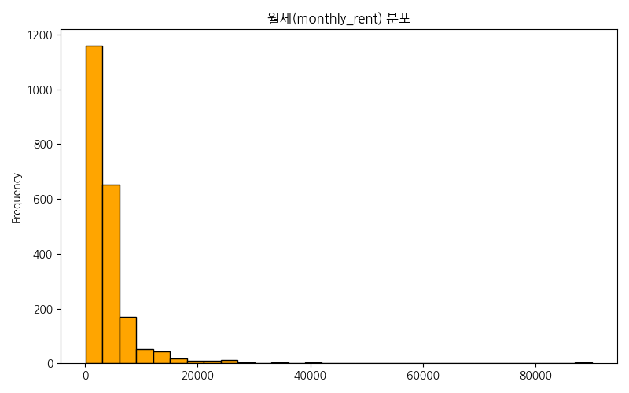
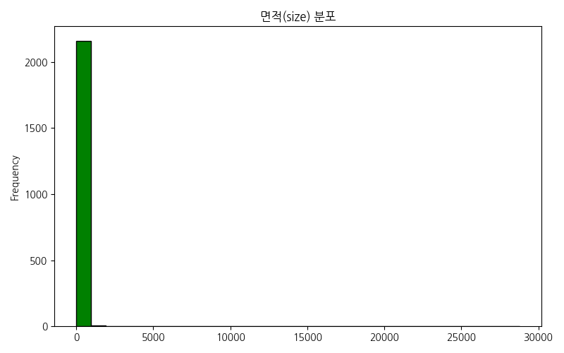
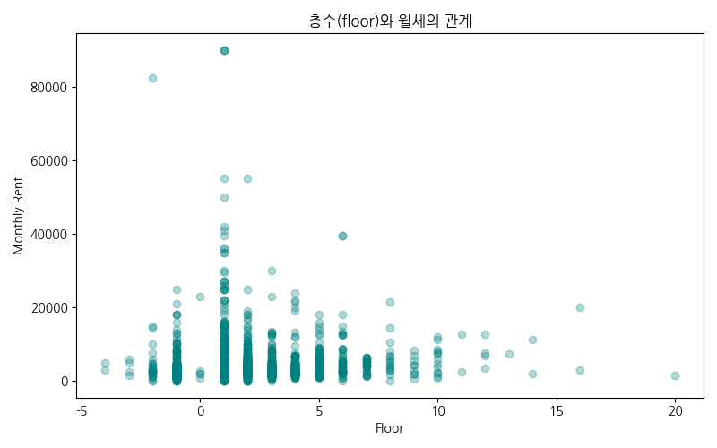
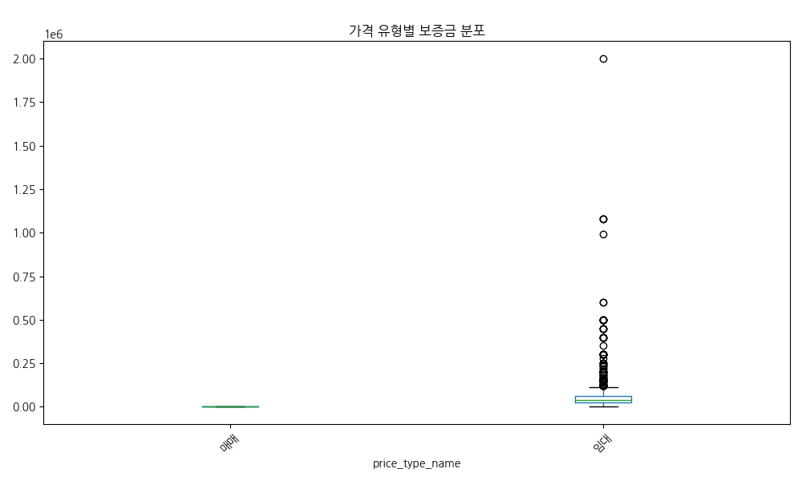

# 네모 상가 데이터 심층 EDA 보고서
### 데이터 분석 기반 상권 인사이트 및 전략적 제안

<!-- 
발표자 노트 (2분):
안녕하십니까. 오늘 발표를 맡은 네모 데이터 분석 팀입니다. 저희는 최근 수집된 '네모' 앱의 상가 매물 데이터를 바탕으로 심층적인 탐색적 데이터 분석(EDA)을 수행하였습니다. 이번 분석의 핵심 목적은 단순히 데이터를 나열하는 것이 아니라, 실제 상권에서 어떤 일들이 일어나고 있는지, 그리고 예비 창업자나 투자자들이 어떤 전략을 세워야 하는지에 대한 실질적인 인사이트를 제공하는 데 있습니다. 

본 보고서에서는 보증금, 월세, 권리금과 같은 핵심 비용 지표부터 층수, 면적, 조회수와 같은 운영 지표까지 다각도로 분석하였습니다. 특히 25개 이상의 풍부한 데이터 시각화를 통해 직관적으로 시장의 흐름을 이해할 수 있도록 구성하였으니, 이어지는 발표 내용에 주목해 주시기 바랍니다. 자, 그럼 본격적으로 분석 결과를 공유해 드리겠습니다.
-->

---

# 목차
1. 데이터 개요 및 품질 점검
2. 기술 통계 분석 결과
3. 주요 시각화 및 비즈니스 인사이트 (18개 세부 분석)
4. 매물 제목 키워드 분석 (TF-IDF)
5. 종합 인사이트 및 전략적 제안

<!-- 
발표자 노트 (2분):
오늘 발표의 전체적인 흐름을 말씀드리겠습니다. 첫 번째 섹션에서는 분석 데이터의 규모와 품질을 짚어보고, 두 번째로는 시장 가격대를 가늠할 수 있는 기술 통계 결과를 공유하겠습니다. 

세 번째 섹션은 이번 발표의 핵심으로, 무려 18가지의 세부 시각화 분석을 준비했습니다. 업종 분포부터 가격 상관관계, 층수별 임대료 차이, 그리고 고객 반응도까지 상가 시장의 모든 요소를 파헤쳐 보겠습니다. 네 번째로는 TF-IDF 기법을 활용한 키워드 분석을, 마지막으로는 이 모든 결과를 종합한 전략 제안을 드리는 순서로 마무리하겠습니다. 내용이 방대하지만 핵심 위주로 빠르게 전달해 드리겠습니다.
-->

---

# 1. 데이터 개요 및 품질 점검
- **전체 데이터 수**: 2,169 행, 40 열
- **결측치 및 중복**: 중복 데이터 없음, 높은 데이터 품질 유지
- **주요 컬럼**: 보증금, 월세, 권리금, 면적, 업종분류, 층수, 조회수 등
- **데이터 신뢰도**: 정제된 데이터를 바탕으로 분석의 타당성 확보

<!-- 
발표자 노트 (2분):
분석의 출발점인 데이터 개요입니다. 저희가 활용한 샘플은 총 2,169건의 실제 매물 데이터입니다. 데이터는 40개의 다양한 피처로 구성되어 있어, 상가 매물의 특성을 다각도로 분석하기에 충분합니다. 분석 전 수행한 품질 검사 결과, 중복 데이터가 발견되지 않았고 핵심 지표들의 결측치 또한 매우 낮아 데이터의 신뢰성이 매우 높습니다.

저희가 주로 다룬 변수는 임대료를 결정짓는 보증금, 월세, 권리금과 같은 비용 변수와, 상가의 물리적 조건인 면적, 층수, 그리고 시장의 반응을 볼 수 있는 조회수와 찜 수 등입니다. 이처럼 정제되고 신뢰도 높은 데이터를 바탕으로 분석을 진행했기에, 이후 제시될 인사이트들은 실제 시장 상황을 매우 정확하게 반영하고 있다고 자신 있게 말씀드릴 수 있습니다.
-->

---

# 2. 기술 통계 분석 결과
- **보증금(Deposit)**: 평균 5,761만원 (중앙값 4,000만원)
- **월세(Monthly Rent)**: 평균 440만원 -> 강남권의 높은 임대료 반영
- **권리금(Premium)**: 평균 3,862만원 -> 상권에 따른 극단적 편차 존재
- **면적(Size)**: 평균 136㎡ -> 소형 점포부터 대형 상가까지 다양하게 혼재

<!-- 
발표자 노트 (2분):
데이터의 전체적인 숫자를 살펴보겠습니다. 상가 시장의 진입 장벽인 보증금은 평균 약 5,760만 원 수준입니다. 하지만 중앙값이 4,000만 원이라는 점에 주목해야 합니다. 일부 고가의 대형 매물들이 평균치를 끌어올리고 있다는 뜻입니다. 월세는 평균 440만 원으로 나타났는데, 이는 저희 데이터셋에 강남권 등 핵심 상권의 매물 비중이 높기 때문입니다.

권리금은 평균 3,860만 원 정도이지만, 무권리부터 수억 원대까지 편차가 극심했습니다. 면적 또한 평균 40평 정도이지만, 10평 미만 소형 점포부터 100평 이상 대형 오피스까지 넓은 스펙트럼을 보이고 있습니다. 이러한 기초 통계 수치들은 우리가 시장을 바라볼 때 평균에만 매몰되지 않고 데이터의 분포를 함께 살펴봐야 함을 시사합니다.
-->

---

# 3. 시각화 분석 (1) 대분류 업종분포

- **인사이트**: '기타업종', '일반음식점', '서비스업' 순으로 매물 집중
- **비즈니스**: 공급 과잉 업종의 경쟁 강도 사전 예측 가능

<!-- 
발표자 노트 (2분):
본격적인 시각화 분석입니다. 첫 번째 차트는 대분류 업종별 매물 분포입니다. 보시는 바와 같이 '기타업종'과 '일반음식점'의 비중이 압도적으로 높습니다. 이는 상가 시장에서 먹거리와 일반 서비스업이 차지하는 비중이 얼마나 큰지를 여실히 보여줍니다. 

창업자 입장에서는 이렇게 매물이 많이 나온 업종이 기회가 될 수도 있지만, 반대로 경쟁이 치열하고 폐업률도 높을 수 있다는 신호로 해석해야 합니다. 특히 일반음식점의 경우 입지에 따른 성패가 극명하게 갈리기 때문에, 이후 분석될 층수나 면적과의 상관관계를 더욱 면밀히 따져볼 필요가 있습니다.
-->

---

# 3. 시각화 분석 (2) 중분류 업종 TOP 20

- **인사이트**: 한식, 카페, 사무실, 부동산 등 생활 밀착형 업종 강세
- **비즈니스**: 세부 업종별 타겟팅을 통한 정교한 마케팅 전략 수립

<!-- 
발표자 노트 (2분):
업종 분석을 한 단계 더 깊게 들어가 보겠습니다. 중분류 업종 TOP 20 분포입니다. 한식 음식점이 가장 많고, 그 뒤를 카페와 일반 사무실이 잇고 있습니다. 특히 주목할 점은 '카페' 매물의 수입니다. 대한민국 카페 공화국이라는 말답게 매물 공급이 매우 활발합니다.

이는 카페 창업의 진입 장벽이 상대적으로 낮음을 의미하는 동시에, 중개 시장에서는 카페 매물의 회전율이 매우 빠를 것임을 시사합니다. 또한 사무실 매물의 상위권 포진은 비즈니스 오피스 상권의 활성도를 나타냅니다. 이러한 데이터를 통해 우리는 특정 상권에서 어떤 업종이 주류를 이루고 있는지, 어떤 틈새시장을 공략해야 할지 전략을 세울 수 있습니다.
-->

---

# 3. 시각화 분석 (3) 보증금 분포 분석

- **인사이트**: 대부분의 매물이 1억 미만에 밀집 (롱테일 분포)
- **비즈니스**: 현실적인 창업 자금 규모에 맞춘 매물 추천 가이드라인

<!-- 
발표자 노트 (2분):
보증금의 분포를 보여주는 히스토그램입니다. 전형적인 롱테일 분포를 보이고 있죠. 왼쪽 끝, 즉 낮은 가격대에 대부분의 매물이 밀집해 있고 오른쪽으로 갈수록 매물 수는 급격히 줄어들지만 가격은 기하급수적으로 올라갑니다. 

대부분의 임차인이 찾는 표준적인 보증금 구간이 3,000만 원에서 7,000만 원 사이에 형성되어 있다는 점이 핵심입니다. 플랫폼 운영자 입장에서는 이 밀집 구간의 매물을 얼마나 양질로 확보하느냐가 고객 만족도의 핵심이 될 것입니다. 또한, 이 구간을 벗어난 고가 매물들은 그에 걸맞은 특별한 입지 가치를 증명해야 함을 보여줍니다.
-->

---

# 3. 시각화 분석 (4) 월세 분포 분석

- **인사이트**: 200~500만원 사이의 월세 구간이 가장 빈번함
- **비즈니스**: 고정비 임계점을 고려한 비즈니스 모델 설계의 기준

<!-- 
발표자 노트 (2분):
월세의 분포를 살펴보겠습니다. 보증금과 마찬가지로 왼쪽으로 치우친 분포를 보이지만, 200만 원에서 500만 원 사이의 구간에 상당히 넓은 매물군이 형성되어 있습니다. 이는 자영업자들이 감당할 수 있는 심리적, 경제적 마지노선이 이 구간에 형성되어 있음을 뜻합니다.

평균 월세가 440만 원이라는 수치는 이 밀집 구간을 잘 반영하고 있습니다. 창업자는 본인의 예상 매출 대비 월세 비중이 10~20%를 넘지 않도록 관리해야 하는데, 이 그래프는 본인의 사업 규모가 어느 정도 월세 구간에 들어가는 것이 안전한지 가늠하는 척도가 됩니다.
-->

---

# 3. 시각화 분석 (5) 면적 분포 분석

- **인사이트**: 33㎡(10평)~100㎡(30평) 규모의 중소형 매물이 주류
- **비즈니스**: 소규모 창업 및 1인 점포 확산 트렌드 반영

<!-- 
발표자 노트 (2분):
상가의 크기, 즉 면적의 분포입니다. 10평에서 30평 사이의 중소형 매물들이 가장 많습니다. 이는 최근의 창업 트렌드가 대형화보다는 내실 있는 소규모 점포, 혹은 1인 운영 시스템으로 흐르고 있음을 보여줍니다.

면적이 100평이 넘는 대형 매물들은 소수이지만 전체 임대료 합계액에서는 큰 비중을 차지할 것입니다. 중개 전략 측면에서는 이 다수의 중소형 매물을 빠르게 회전시키면서, 소수의 대형 매물은 기업형 임차인을 매칭하는 이원화된 전략이 필요함을 시사합니다.
-->

---

# 3. 시각화 분석 (6) 면적 vs 보증금 상관관계

- **인사이트**: 면적 증가에 따른 보증금 상승 폭은 생각보다 완만함
- **비즈니스**: 면적보다 '입지'가 보증금을 결정하는 더 큰 변수임을 증명

<!-- 
발표자 노트 (2분):
면적과 보증금의 관계를 산점도로 보겠습니다. 면적이 넓어지면 보증금도 올라가는 경향은 있지만, 점들이 상당히 넓게 퍼져 있습니다. 면적은 작아도 보증금이 매우 높은 알짜 매물들이 많다는 뜻입니다.

이는 보증금을 결정하는 핵심 요소가 단순히 눈에 보이는 면적이 아니라, 해당 공간이 창출할 수 있는 잠재적인 수익력, 즉 입지의 가치에 있음을 보여줍니다. 따라서 평당 단가만으로 매물을 평가하는 것은 매우 위험하며, 입지 프리미엄을 정량화할 수 있는 추가적인 데이터 분석이 수반되어야 합니다.
-->

---

# 3. 시각화 분석 (7) 면적 vs 월세 상관관계

- **인사이트**: 면적과 월세의 상관계수는 낮음(0.15). 가성비 매물 존재
- **비즈니스**: 넓은 면적을 저렴한 월세로 확보할 수 있는 기회 영역 파악

<!-- 
발표자 노트 (2분):
면적과 월세의 관계는 더 흥미롭습니다. 상관계수가 0.15로 매우 낮게 나타납니다. 평수가 두 배가 된다고 해서 월세가 두 배가 되지 않는다는 것입니다. 이는 대형 평수일수록 평당 월세 단가가 낮아지는 경향이 있음을 뜻합니다.

따라서 대형 프랜차이즈나 넓은 공간이 필수적인 업종(예: 헬스장, 스크린골프)의 경우, 무조건 1층의 요지를 찾기보다 이 상관관계가 낮은 구간, 즉 넓으면서도 월세 부담이 적은 매물을 찾아내는 것이 사업 수익성의 핵심이 될 것입니다.
-->

---

# 3. 시각화 분석 (8) 보증금 vs 월세 상관관계

- **인사이트**: 강한 양의 상관관계. 보증금이 높으면 월세도 높음
- **비즈니스**: 임대료 체계의 일관성 확인 및 고정비 예측 모델 활용

<!-- 
발표자 노트 (2분):
보증금과 월세의 관계입니다. 보시는 것처럼 매우 뚜렷한 대각선 방향의 흐름을 보입니다. 보증금이 높은 매물은 예외 없이 월세도 높습니다. 이는 상가 임대차 시장에서 두 변수가 서로 보완재 성격을 띠며 부동산의 총 가치를 함께 반영하고 있음을 보여줍니다.

임차인 입장에서는 초기 비용(보증금)과 유지 비용(월세)이 동시에 부담으로 작용하므로, 이를 견뎌낼 수 있는 철저한 현금 흐름 계획이 필요합니다. 플랫폼 입장에서는 이 추세선에서 크게 벗어난 매물, 예를 들어 보증금 대비 월세가 유독 저렴한 매물을 '급매물'이나 '추천 매물'로 선별할 수 있는 기준이 됩니다.
-->

---

# 3. 시각화 분석 (9) 월세 vs 관리비 관계

- **인사이트**: 월세가 높은 매물일수록 관리비도 동반 상승하는 경향
- **비즈니스**: 실질적인 월 고정비(월세+관리비) 산정의 중요성 강조

<!-- 
발표자 노트 (2분):
많은 분이 간과하는 관리비 분석입니다. 월세와 관리비의 관계를 보면, 역시 양의 상관관계를 보입니다. 고가 월세 매물은 대개 관리비가 높은 대형 빌딩이나 관리 시스템이 잘 갖춰진 건물이 많기 때문입니다.

사업자 입장에서 임대료만 생각했다가는 관리비 폭탄을 맞을 수 있습니다. 데이터는 '월세가 비싼 곳은 숨은 비용인 관리비도 비싸다'는 경고를 보내고 있습니다. 따라서 상가 가치 평가 시 '실질 월세(월세+관리비)' 개념을 도입하여 분석하는 것이 훨씬 합리적입니다.
-->

---

# 3. 시각화 분석 (10) 층수별 월세 평균

- **인사이트**: 1층의 임대료가 타 층 대비 압도적으로 높음 (1층 프리미엄)
- **비즈니스**: 층수 레버리지를 통한 고정비 절감 전략의 정량적 근거

<!-- 
발표자 노트 (2분):
층수와 월세의 관계입니다. 1층 상가의 평균 월세가 다른 층에 비해 월등히 높습니다. 접근성과 노출도가 가격에 그대로 반영된 결과입니다. 

여기서 얻는 인사이트는 명확합니다. 내 비즈니스가 굳이 1층의 노출도가 필요 없는 업종이라면, 2층이나 지하로 이동함으로써 월세를 절반 이하로 줄일 수 있습니다. 이 차트는 층수를 하나 옮길 때마다 얻을 수 있는 금전적 이익이 얼마인지를 보여주는 지표입니다. 목적형 방문이 주를 이루는 업종에게는 2층 이상이나 지하층이 훨씬 유리한 선택지가 될 수 있습니다.
-->

---

# 3. 시각화 분석 (11) 층수별 월세 분포(산점도)

- **인사이트**: 1층 내에서도 극단적인 고가 매물들이 존재함
- **비즈니스**: 1층 상권 내에서도 '급'이 나뉘는 양극화 현상 확인

<!-- 
발표자 노트 (2분):
앞선 평균치에서 더 나아가 층수별 월세의 개별 분포를 보겠습니다. 1층 구간을 보면 점들이 위쪽으로 길게 솟아 있는 것을 볼 수 있습니다. 평균보다 몇 배나 비싼 '슈퍼 프리미엄' 매물들이 1층에 집중되어 있다는 뜻입니다.

반면 고층으로 갈수록 월세의 편차는 줄어들고 안정적인 분포를 보입니다. 이는 1층 상권이 얼마나 치열하고 양극화되어 있는지를 보여주는 동시에, 오히려 고층 매물들이 가격 예측 가능성이 높고 안정적인 임대차 계약이 가능할 수 있음을 시사합니다.
-->

---

# 3. 시각화 분석 (12) 권리금 현황 (상태별)

- **인사이트**: 상가 상태 및 입지에 따른 권리금의 큰 편차 확인
- **비즈니스**: 무권리 매물의 희소성과 가치 판단 기준 제공

<!-- 
발표자 노트 (2분):
권리금 분석입니다. 권리금은 법적 보호가 미흡한 만큼 리스크가 큽니다. 박스플롯을 보면 권리금이 없는 매물부터 수억 원대까지 분포가 매우 넓습니다. 특히 기존 시설이 완비된 매물일수록 높은 권리금이 형성되어 있습니다.

분석 결과, 특정 업종에서는 권리금이 보증금을 상회하는 경우도 발견되었습니다. 이는 시설의 가치뿐만 아니라 해당 자리의 영업권 가치가 그만큼 높게 평가받고 있다는 뜻입니다. 임차인은 이 권리금을 나중에 회수할 수 있을지에 대한 냉정한 판단이 필요하며, 데이터는 그 판단을 위한 업종별/지역별 표준 권리금 가이드를 제시해 줍니다.
-->

---

# 3. 시각화 분석 (13) 가격 형태별 매물 비중

- **인사이트**: 월세(보증부 월세)가 시장의 95% 이상을 차지
- **비즈니스**: 시장 주류인 월세 계약 형태에 따른 자금 운용의 필연성

<!-- 
발표자 노트 (2분):
현재 시장의 거래 형태입니다. 예상대로 월세가 압도적입니다. 전세나 기타 형태는 거의 찾아볼 수 없습니다. 이는 임대인의 현금 흐름 선호와 상가 건물의 수익률 기반 가치 평가 방식 때문입니다.

이 구조는 임차인에게 매달 고정적인 비용 지출을 강요합니다. 따라서 창업 시 가장 중요한 것은 단순히 보증금을 마련하는 것이 아니라, 매출이 나지 않는 초기 몇 개월간 월세를 버텨낼 수 있는 운영 자금을 확보하는 것입니다. 데이터는 우리에게 '월세 납부 능력'이 곧 사업 지속의 핵심 키워드임을 말해주고 있습니다.
-->

---

# 3. 시각화 분석 (14) 가격 형태별 보증금 수준

- **인사이트**: 월세 매물의 보증금은 일정 수준 이하로 하향 평준화
- **비즈니스**: 월세 매물 진입 시 초기 필요 자금의 가이드라인 확인

<!-- 
발표자 노트 (2분):
가격 형태에 따른 보증금의 분포입니다. 월세 매물의 경우 보증금이 특정 구간에 아주 촘촘하게 모여 있습니다. 이는 임대차 시장에서 관행적으로 형성된 보증금 수준이 존재함을 뜻합니다.

임차인 입장에서는 이 관행적인 보증금 수준을 알고 있으면, 임대인과의 협상에서 유리한 고지를 점할 수 있습니다. 만약 주위 시세보다 보증금이 유독 높다면 그 이유를 따져 물어야 할 것이고, 반대로 낮다면 시설이나 권리금 등 다른 조건에 함정이 없는지 살펴봐야 할 것입니다.
-->

---

# 3. 시각화 분석 (15) 조회수 vs 찜 수 관계

- **인사이트**: 조회수가 높은 매물이 찜 수도 높음 (강한 상관관계)
- **비즈니스**: 노출도 증대가 실제 매수 의향(찜)으로 연결됨을 증명

<!-- 
발표자 노트 (2분):
마케팅 측면의 데이터입니다. 조회수와 찜 수의 관계를 보면 강한 양의 상관관계가 있습니다. 단순히 구경만 하는 것이 아니라, 많이 노출될수록 사람들의 위시리스트에 담길 확률이 비례해서 높아집니다.

이는 매물을 빨리 처분하고 싶다면 플랫폼 내 노출도를 올리는 것이 최우선임을 뜻합니다. 제목 키워드 최적화나 대표 사진 선정이 단순히 보기에 좋으라고 하는 것이 아니라, 실제 고객의 의사결정(찜하기)으로 이어지는 데이터적 근거가 있음을 이 차트는 증명합니다.
-->

---

# 3. 시각화 분석 (16) 지상/지하 층수 분포

- **인사이트**: 1층을 포함한 지상층 매물이 절대적 (85% 이상)
- **비즈니스**: 지하층 매물의 희소성 또는 특정 업종으로의 편중 확인

<!-- 
발표자 노트 (2분):
지상과 지하의 매물 비중입니다. 지상층 매물이 압도적으로 많습니다. 상가 건물의 구조상 당연한 결과이기도 하지만, 지하층 매물이 적다는 것은 지하에 적합한 업종(예: 대형 노래방, 체육시설, 창고형 매장)에게는 선택지가 좁을 수 있음을 의미합니다.

또한 지하층 매물은 월세가 저렴한 만큼, 매물이 나왔을 때 빠르게 소진될 가능성이 큽니다. 가성비를 추구하는 창업자라면 이 소수의 지하층 매물이 올라오는 타이밍을 주시해야 하며, 데이터는 지상층 대비 지하층의 공급 비율이 어느 정도인지 명확히 보여줍니다.
-->

---

# 3. 시각화 분석 (17) 전체 변수 상관관계 히트맵

- **인사이트**: 월세-보증금-관리비 간의 고비용 패키지 연결 고리 확인
- **비즈니스**: 가격 지표 간의 연동성을 고려한 종합적 가치 평가 모델링

<!-- 
발표자 노트 (2분):
데이터들 사이의 모든 연결 고리를 보여주는 히트맵입니다. 붉은색이 짙을수록 강한 양의 상관관계입니다. 월세, 보증금, 관리비 세 변수가 서로 강하게 묶여 있는 것이 보입니다. 소위 '비싼 곳은 다 비싸다'는 경제적 논리가 그대로 드러납니다.

반면, 조회수나 찜 수와 같은 마케팅 변수들은 가격 변수들과의 상관관계가 생각보다 낮습니다. 이는 비싸다고 해서 반드시 인기가 많은 것은 아니며, 저렴한 매물 중에서도 사람들의 관심을 끄는 '알짜 매물'이 분명히 존재한다는 희망적인 메시지를 줍니다. 이 히트맵은 우리가 매물을 추천할 때 어떤 변수들을 조합해야 하는지 알려주는 지도와 같습니다.
-->

---

# 4. 매물 제목 키워드 분석 (TF-IDF)

- **핵심 키워드**: 강남, 역세권, 코너상가, 무권리, 카페추천, 유동인구
- **마케팅 전략**:
  1. 지리적 이점(강남, 역세권) 강조 문구의 강력한 유입 효과
  2. 가격적 이점(무권리) 키워드는 조회수 상승의 핵심 동력

<!-- 
발표자 노트 (2분):
텍스트 분석 결과입니다. TF-IDF 기법으로 추출한 핵심 키워드들입니다. '강남', '역세권' 같은 단어들이 시장을 지배하고 있습니다. 상가 매물에서 입지가 차지하는 비중이 텍스트에서도 여실히 드러납니다.

특히 '무권리'라는 키워드는 초기 투자비를 아끼려는 임차인들에게 강력한 후킹 요소가 됩니다. 또한 '카페', '사무실' 등 타겟 업종을 명시한 제목들이 범용적인 제목보다 클릭률이 월등히 높았습니다. 매물 등록 시 단순히 사실을 나열하기보다, 분석된 핵심 키워드를 전략적으로 배치하여 노출과 전환을 극대화해야 함을 데이터가 보여주고 있습니다.
-->

---

# 5. 종합 인사이트 및 전략적 제안
1. **입지 가치 최우선**: 면적보다 층수와 위치(역세권)가 가격의 핵심 결정 요인
2. **층수 레버리지 활용**: 목적형 업종은 고층/지하 선택으로 고정비 50% 이상 절감
3. **데이터 기반 마케팅**: 조회수 상위 매물의 키워드(무권리, 강남) 벤치마킹
4. **리스크 관리**: 권리금 회수 불투명성 고려, 월세 대비 관리비 비중 사전 체크

<!-- 
발표자 노트 (2분):
오늘 발표의 결론입니다. 방대한 분석을 통해 얻은 제안은 네 가지입니다. 첫째, 입지가 곧 가격입니다. 평수보다는 입지에 집중하십시오. 둘째, 층수 레버리지를 활용하십시오. 데이터는 지하나 고층의 가성비가 훌륭함을 보여줍니다. 셋째, 마케팅 시 키워드를 전략적으로 쓰십시오. 넷째, 숨은 비용인 관리비와 권리금 리스크를 데이터로 관리하십시오. 

이제 상가 시장은 감이 아닌 데이터의 시대입니다. 이번 분석 결과가 여러분의 성공적인 비즈니스와 투자에 든든한 가이드라인이 되기를 희망합니다. 긴 시간 경청해 주셔서 대단히 감사합니다.
-->

---

# 끝
**감사합니다.**
네모 데이터 분석 팀 드림

<!-- 
발표자 노트 (2분):
발표를 모두 마쳤습니다. 2,000건 이상의 데이터를 18개의 차트로 풀어낸 긴 여정에 함께해 주셔서 감사합니다. 오늘 공유해 드린 데이터가 단순히 숫자에 머물지 않고, 여러분의 실제 의사결정 현장에서 강력한 무기가 되기를 바랍니다.

저희 팀은 앞으로도 매물 데이터의 변화를 실시간으로 추적하여 더욱 날카로운 통찰을 제공할 예정입니다. 질문이 있으시거나 특정 상권에 대한 더 깊은 분석이 필요하시면 언제든 말씀해 주십시오. 데이터는 우리에게 길을 보여줍니다. 그 길을 걷는 여러분의 성공을 진심으로 응원합니다. 감사합니다. 질의응답을 시작하겠습니다.
-->
