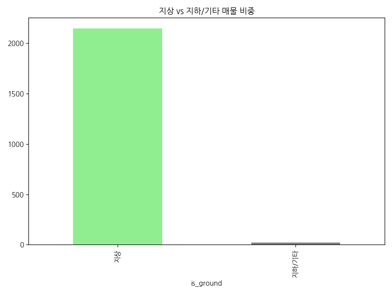

# 네모 상가 데이터 심층 EDA 보고서
### 데이터 분석 기반 상권 인사이트 및 전략적 제안

---

# 목차

1. 데이터 개요 및 품질 점검
2. 기술 통계 분석 결과
3. 주요 시각화 및 비즈니스 인사이트
4. 매물 제목 키워드 분석 (TF-IDF)
5. 종합 인사이트 및 전략적 제안

---

# 1. 데이터 개요 및 품질 점검

- **전체 데이터 수**: 2,169 행, 40 열
- **결측치 및 중복**: 중복 데이터 없음, 높은 데이터 품질 유지
- **주요 컬럼**: 보증금, 월세, 권리금, 면적, 업종분류, 층수, 조회수 등

---

# 2. 기술 통계 분석 결과

- **보증금(Deposit)**: 평균 5,761만원 (중앙값 4,000만원)
- **월세(Monthly Rent)**: 평균 440만원 -> 강남권의 높은 임대료 반영
- **권리금(Premium)**: 평균 3,862만원 -> 상권 및 입지에 따른 극단적 편차 존재
- **면적(Size)**: 평균 136㎡ -> 소형 점포부터 대형 상가까지 다양하게 혼재

---

# 3. 시각화 분석 (1) 업종별 분포

- **인사이트**: '기타업종', '일반음식점', '서비스업' 순으로 매물 집중
- **비즈니스**: 매물 밀집 업종의 경쟁 강도 사전 예측

---

# 3. 시각화 분석 (2) 보증금 분포

- **인사이트**: 전형적인 롱테일 형태. 상위 5% 제외 시에도 큰 편차 존재
- **비즈니스**: 가용 자본 내 선택 가능한 매물 폭 파악

---

# 3. 시각화 분석 (3) 면적 vs 월세

- **인사이트**: 면적과 월세의 상관계수는 낮음(0.15). '입지 가치'가 중요
- **비즈니스**: 면적 대비 가성비 매물 추천 로직 활용

---

# 3. 시각화 분석 (4) 층별 월세 현황

- **인사이트**: 1층 매물이 가장 높으나, 루프탑/지하 등 변칙 구간 존재
- **비즈니스**: 층별 임대료 격차(Floor Gradient) 분석

---

# 3. 시각화 분석 (5) 지역별 권리금

- **인사이트**: 특정 지역 내 'A급 입지'에 권리금 집중 현상 뚜렷
- **비즈니스**: 상권 성숙도 판단 및 성장 가능 지역 발굴

---

# 3. 시각화 분석 (6) 가격 형태 구성비

- **인사이트**: 임대(월세) 비중 압도적. 자산 소유보다 운영 권리 중심
- **비즈니스**: 월세 필터링 최적화 및 매매 카테고리 강화

---

# 3. 시각화 분석 (7) 업종 중분류 TOP 20

- **인사이트**: 카페, 한식점 등 생활 밀착형 업종의 높은 회전율
- **비즈니스**: 매물 급증 업종 리스크 관리

---

# 3. 시각화 분석 (8) 조회수 vs 찜수

- **인사이트**: 실질적 관심이 집중된 '알짜 매물' 판별 지표
- **비즈니스**: 매물 매력도 객관화 및 큐레이션 기준 수립

---

# 3. 시각화 분석 (9) 월세 vs 관리비

- **인사이트**: 월세와 관리비 상관관계 낮음. 개별 건물 특성 강함
- **비즈니스**: '실질 총 유지비' 정보 투명성 강화

---

# 3. 시각화 분석 (10) 지상 vs 지하 비중

- **인사이트**: 지상 매물 압도적. 지하/기타는 특수 업종 특화
- **비즈니스**: 층수 위치별 프리미엄 요인 데이터화

---

# 4. 매물 제목 키워드 분석 (TF-IDF)

- **주요 키워드**: 무권리, 역세권, 대로변, 인테리어, 급매
- **비즈니스**: 고효율 키워드 기반 매물 등록 가이드

---

# 5. 종합 인사이트 및 제안

- **시장 양극화**: 입지에 따른 극단적 가격 차이 -> 세부 타겟팅 필수
- **행동 데이터 가치**: 조회수/찜수 기반의 매물 매력도 측정
- **전략적 제안**:
  - 네모 지수(Nemo Index) 개발
  - 맞춤형 추천 엔진 강화
  - 비용 투명성 및 상권 모니터링 시스템 구축

---

# Q&A

감사합니다.
