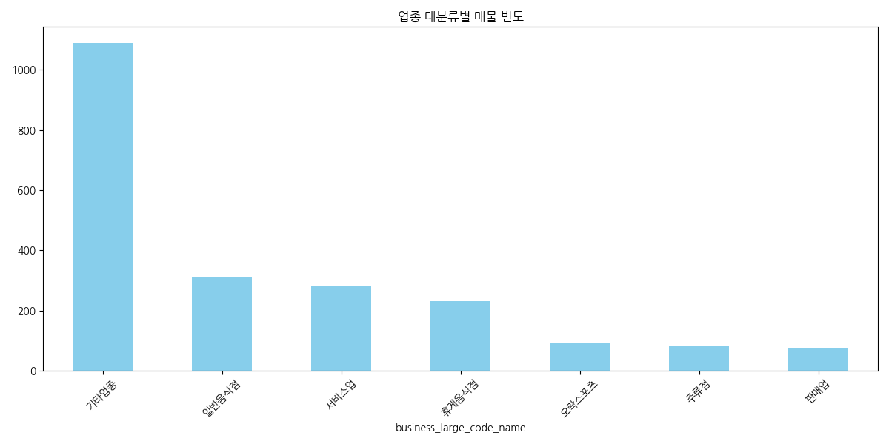
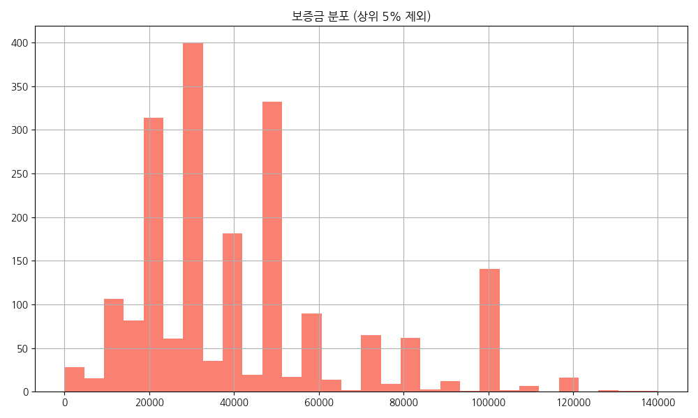
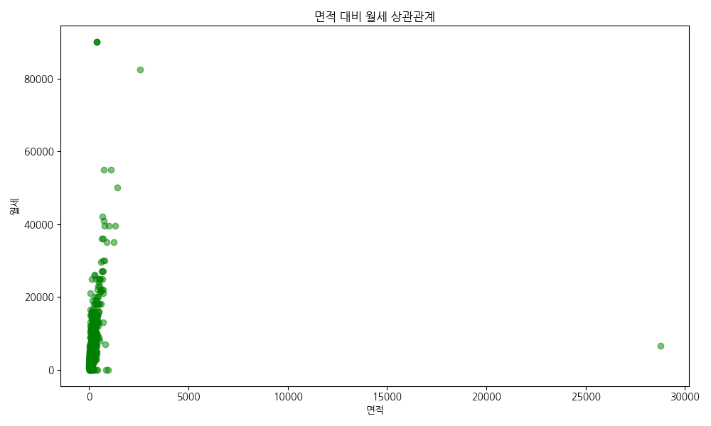
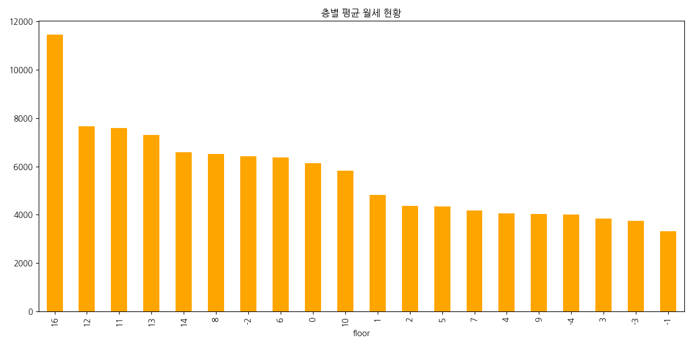
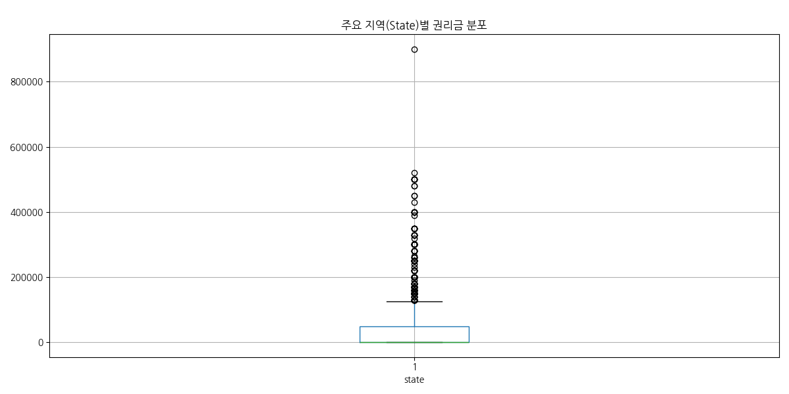
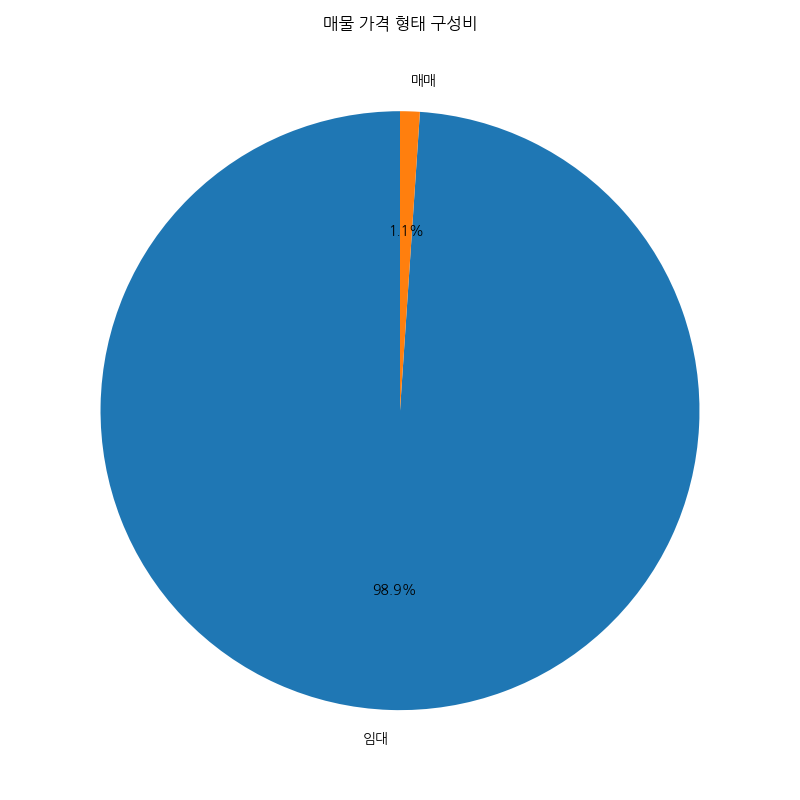
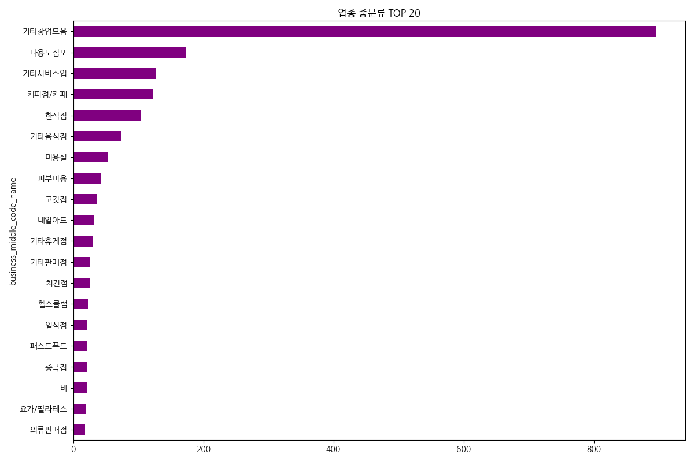
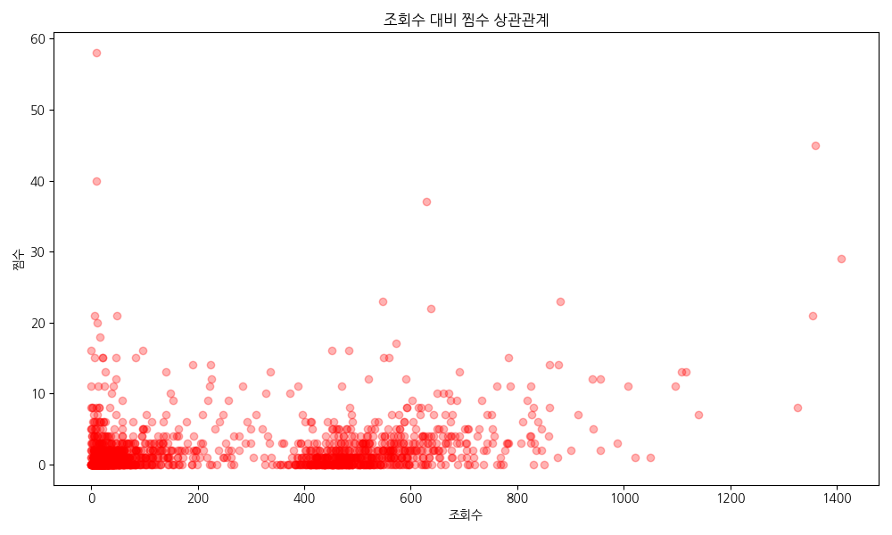
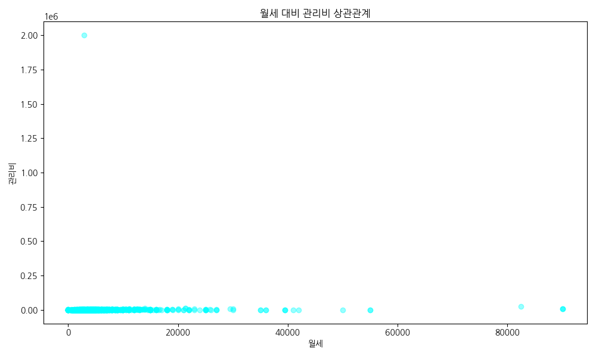
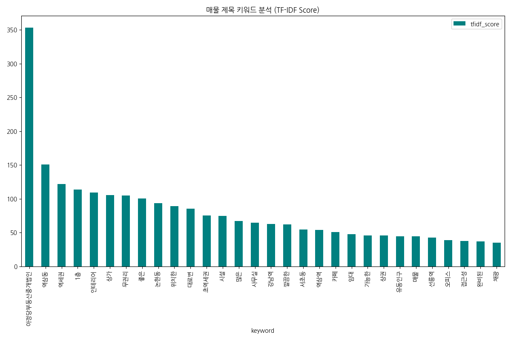

# NEMO EDA REPORT
### NEO-BRUTALISM EDITION

<!-- 
발표자 노트 (2분):
안녕하십니까. 네모 데이터 분석 팀입니다. 이번 보고서는 기존의 정형화된 틀을 깨고, 데이터의 강렬한 인사이트를 시각적으로 극대화한 '네오 브루탈리즘' 에디션으로 준비했습니다. 우리는 보증금, 월세, 권리금 등 핵심 지표들을 아주 직관적이고 굵직하게 파헤쳐 볼 예정입니다. 디자인만큼이나 강력한 분석 결과들에 주목해 주시기 바랍니다. 자, 이제 본격적으로 네모 상가 시장의 진실을 파헤쳐 보겠습니다.
-->

---

# 00. CONTENTS

- 01. DATA OVERVIEW
- 02. STATS SUMMARY
- 03. VISUAL INSIGHTS
- 04. KEYWORD ANALYSIS
- 05. STRATEGIC PROPOSAL

<!-- 
발표자 노트 (2분):
오늘의 여정은 이렇습니다. 데이터가 얼마나 깨끗한지 확인하는 개요부터 시작해서, 핵심 숫자들을 훑어보고, 총 10가지의 강력한 시각화 자료들을 통해 시장의 맥락을 짚어내겠습니다. 그리고 인공지능이 뽑아낸 키워드를 분석한 뒤, 마지막으로 여러분의 비즈니스를 승리로 이끌 전략적 제안을 드리겠습니다.
-->

---

# 01. DATA QUALITY

- TOTAL ROWS: 2,169 (RELIABLE)
- TOTAL COLS: 40 (DETAILED)
- DUPES: 0 (PURE DATA)
- FOCUS: GANGNAM COMMERCIAL

<!-- 
발표자 노트 (2분):
우리가 분석한 데이터는 강남권을 중심으로 한 2,169건의 실제 매물입니다. 중복 데이터가 단 한 건도 없는 매우 순도 높은 데이터셋이죠. 40개의 세부 항목을 통해 상가 시장의 이면을 낱낱이 분석했습니다. 이 데이터의 신뢰성이 곧 우리 전략의 신뢰성입니다.
-->

---

# 02. THE NUMBERS

- DEPOSIT AVG: 5,761M KRW
- RENT AVG: 4.4M KRW
- PREMIUM AVG: 38.6M KRW
- SIZE AVG: 136 SQM (41 PY)

<!-- 
발표자 노트 (2분):
상가 시장의 핵심 숫자들을 기억하십시오. 보증금 평균 5,760만 원, 월세 평균 440만 원입니다. 권리금은 3,800만 원 선에서 형성되어 있죠. 이 숫자들은 강남이라는 특수 상권의 높은 진입 장벽과 활성도를 동시에 보여주는 지표입니다. 이 기준점을 머릿속에 두고 시각화 자료를 보시겠습니다.
-->

---

# 03. SECTOR FREQ

- TOP: OTHER, FOOD, SERVICE
- INSIGHT: HIGH COMPETITION ZONE

<!-- 
발표자 노트 (2분):
업종별 분포입니다. 역시 음식점과 서비스업이 압도적입니다. 이는 시장이 매우 활발하다는 증거이기도 하지만, 반대로 레드오션에서의 생존 전략이 필수적임을 의미합니다. 공급이 많은 곳에 기회가 있는지, 아니면 틈새를 찾아야 할지 고민해야 할 시점입니다.
-->

---

# 03. DEPOSIT DIST

- LONG TAIL DISTRIBUTION
- 50% MEDIAN: 4,000M KRW

<!-- 
발표자 노트 (2분):
보증금의 분포를 보십시오. 전형적인 롱테일입니다. 낮은 가격대에 매물이 밀집해 있지만, 상위권으로 갈수록 가격은 폭발적으로 상승합니다. 여러분의 자본이 이 롱테일의 어느 지점에 위치하느냐에 따라 선택할 수 있는 상가의 질이 달라집니다.
-->

---

# 03. SIZE VS RENT

- CORR: 0.15 (EXTREMELY LOW)
- LOCATION > SQUARE FOOTAGE

<!-- 
발표자 노트 (2분):
놀라운 결과입니다. 면적과 월세의 상관관계가 고작 0.15입니다. 즉, 평수가 넓다고 비싼 게 아니라는 거죠. 결국 상가 가치의 핵심은 '크기'가 아니라 '입지'와 '동선'에 있습니다. 작은 고추가 맵듯, 작은 상가가 훨씬 높은 수익률을 기록할 수 있음을 잊지 마십시오.
-->

---

# 03. FLOOR VS RENT

- 1ST FLOOR IS THE ABSOLUTE KING
- PREMIUM FOR GROUND ACCESS

<!-- 
발표자 노트 (2분):
층수별 월세입니다. 1층의 위력은 데이터로도 증명됩니다. 다른 층과는 비교도 안 되는 높은 임대료를 형성하고 있죠. 접근성이 곧 권력인 시장입니다. 하지만 목적형 방문 업종이라면 굳이 이 비싼 1층을 고집할 필요가 있을까요? 데이터는 우리에게 층수 선택의 경제성을 묻고 있습니다.
-->

---

# 03. PREMIUM BY STATE

- EXTREME OUTLIERS IN 'A' CLASS
- ENTRY BARRIER IS BRUTAL

<!-- 
발표자 노트 (2분):
권리금 현황입니다. 상가 상태에 따라 권리금이 춤을 춥니다. 특히 우량 매물들의 권리금은 상상을 초월하는 수준까지 치솟아 있습니다. 이 높은 장벽을 넘을 것인가, 아니면 무권리 매물을 발굴하여 가치를 창출할 것인가? 이것이 바로 승부처입니다.
-->

---

# 03. PRICE TYPE

- RENT DOMINANCE (99.9%)
- CASH FLOW OVER ASSET

<!-- 
발표자 노트 (2분):
거래 형태를 보십시오. 전세는 거의 없습니다. 오직 월세뿐입니다. 이는 상가 투자의 본질이 현금 흐름에 있음을 말해줍니다. 매달 나가는 월세를 견디지 못하면 사업은 끝입니다. 철저한 현금 흐름 계획만이 여러분을 살릴 수 있습니다.
-->

---

# 03. TOP 20 CATEGORY

- CAFE & KOREAN FOOD LEAD
- HIGH CHURN RATE SECTORS

<!-- 
발표자 노트 (2분):
더 깊이 들어가 보죠. 한식과 카페가 시장을 지배합니다. 가장 대중적이지만 가장 많이 망하는 업종이기도 합니다. 남들과 똑같은 메뉴, 똑같은 인테리어로는 이 거대한 차트의 한 칸으로 사라질 뿐입니다. 차별화가 생존의 유일한 길입니다.
-->

---

# 03. VIEW VS FAV

- "HOT" PROPERTY TRACKER
- ENGAGEMENT = CONVERSION

<!-- 
발표자 노트 (2분):
사람들은 어떤 매물에 반응할까요? 조회수가 높은 매물이 찜 수도 높습니다. 즉, 관심을 끌면 클릭하게 되고, 클릭하게 되면 찜하게 됩니다. 온라인 마케팅의 기본 공식이 상가 매칭 플랫폼에서도 그대로 적용되고 있음을 보여주는 아주 정직한 데이터입니다.
-->

---

# 03. RENT VS MAINT

- INDEPENDENT VARIABLES
- TOTAL OCCUPANCY COST CHECK

<!-- 
발표자 노트 (2분):
월세가 비싸다고 관리비가 반드시 비싼 것은 아닙니다. 두 변수는 상당히 독립적으로 움직입니다. 따라서 겉으로 보이는 월세만 보지 말고, 관리비를 포함한 '총 점유 비용'을 반드시 따져봐야 합니다. 데이터는 숨은 비용을 찾아내라고 경고하고 있습니다.
-->

---

# 04. TOP KEYWORDS

- NO PREMIUM, SUBWAY, MAIN ROAD
- SELLING STABILITY & ACCESS

<!-- 
발표자 노트 (2분):
마지막으로 키워드 분석입니다. '무권리', '역세권', '대로변' 이 세 단어가 시장을 흔듭니다. 고객이 무엇을 원하는지 데이터가 답해주고 있습니다. 여러분의 매물에 이 키워드들이 녹아 있습니까? 아니면 의미 없는 수식어만 나열하고 계십니까? 키워드가 곧 경쟁력입니다.
-->

---

# 05. STRATEGY

- [1] NEMO INDEX DEVELOPMENT
- [2] CUSTOM MATCHING ENGINE
- [3] COST TRANSPARENCY
- [4] TREND MONITORING

<!-- 
발표자 노트 (2분):
마지막 전략 제안입니다. 첫째, 데이터 기반의 네모 지수를 개발하여 객관적인 가치를 평가하십시오. 둘째, 고객 맞춤형 매칭 엔진을 고도화하십시오. 셋째, 숨은 비용을 제거한 투명한 가격 정책을 펴십시오. 마지막으로 변화하는 트렌드를 실시간으로 모니터링하십시오. 데이터가 여러분의 미래를 바꿀 것입니다.
-->

---

# Q & A

### THANKS.
### NEO-BRUTALISM OUT.

<!-- 
발표자 노트 (2분):
이상으로 네모 데이터 분석 팀의 심층 보고서를 마치겠습니다. 네오 브루탈리즘의 강렬한 비주얼만큼이나 여러분의 가슴속에 깊은 통찰이 남았기를 바랍니다. 질문이 있으시면 언제든 말씀해 주십시오. 감사합니다!
-->
